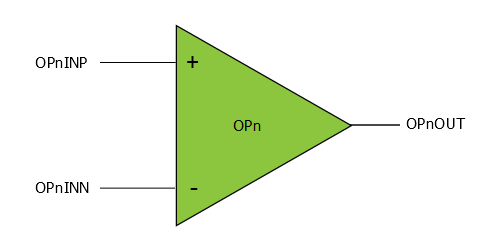
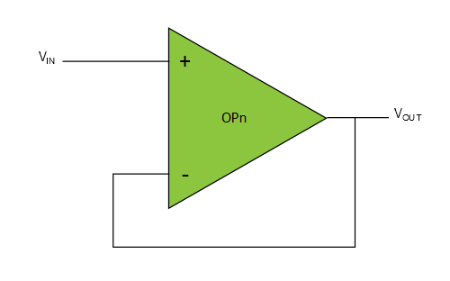
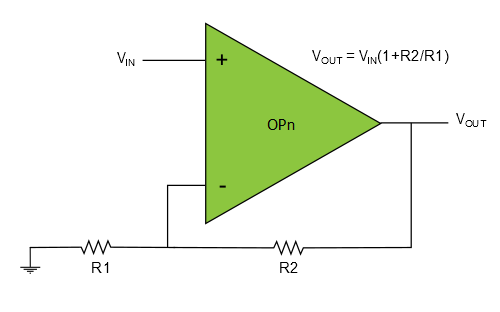
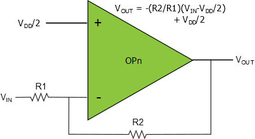
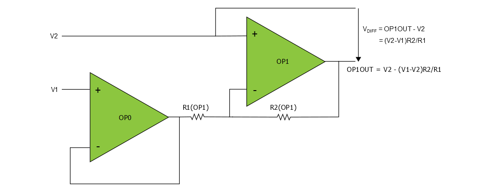
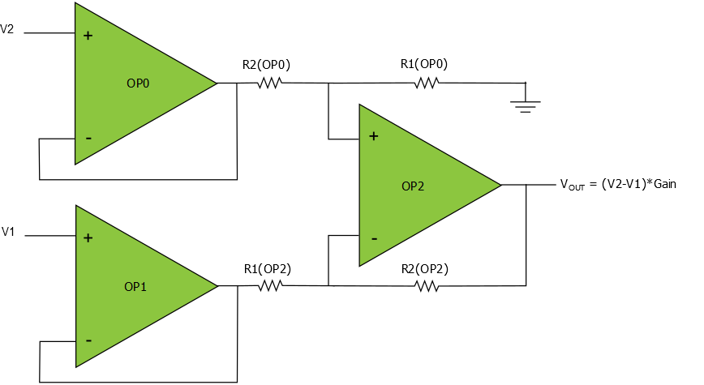

<!-- Please do not change this logo with link -->

# AVR128DB48 Curiosity Nano OPAMP Demonstration Firmware

The AVR128DB48 Curiosity Nano Evaluation Kit is preprogramed to provide a number of different OPAMP configurations, depending on the state of the three input pins PC4, PC5 and PC6. Each of these pins is internally pulled high, If left unconnected the corresponding pin is high and reads logic '1'. Connect the pin directly to ground for logic '0'.

In addition to the OPAMP configuration the onboard LED0 will blink a number of times equal to the current setting. To check current setting and/or reconfigure, click the on board switch(SW0).

## Related Documentation

* [AVR128DB48 Curiosity Nano User Guide](https://www.microchip.com/DS50003037)
* [AVR128DB48 Device Page](https://www.microchip.com/wwwproducts/en/AVR128DB48)

## Software Used

* [MPLAB® X IDE](https://www.microchip.com/mplab/mplab-x-ide) 5.40 or later
* [MPLAB® XC8](https://www.microchip.com/mplab/compilers) 2.20 or later
* MPLAB® X AVR-Dx_DFP version 1.4.75 or later
* For the Atmel Studio version of this project, please go to [this repository](https://github.com/microchip-pic-avr-examples/avr128db48-cnano-opamp-demo-fw-studio)

## Hardware Used

* [AVR128DB48 Curiosity Nano](https://www.microchip.com/DevelopmentTools/ProductDetails/PartNO/EV35L43A)

## Setup

A brand new AVR128DB48 Curiosity Nano comes with this code in this repository already programmed.
It can be reprogrammed to the AVR128DB48 by copying the [hex file](avr128db48-cnano-opamp-demo-fw-mplab.X/dist/free/production/avr128db48-cnano-opamp-demo-fw-mplab.X.production.hex) to the CURIOSITY virtual drive.
It is also possible to open the .X file and program the device using the MPLAB® X IDE.

## Operation

The AVR128DB48 is in standby sleep mode with the OPAMPs enabled in between reconfiguration of the OPAMPs.

| PC6 | PC5 | PC4 | Configuration                  |  
| --- | --- | --- | -------------                  |
|  1  |  1  |  0  | 1 - Connected directly to pins |
|  1  |  0  |  1  | 2 - Voltage follower           |
|  1  |  0  |  0  | 3 - Non-Inverting PGA          |
|  0  |  1  |  1  | 4 - Inverting PGA              |
|  0  |  1  |  0  | 5 - Differential amplifier     |
|  0  |  0  |  1  | 6 - Instrumentation amplifier  |  

If the pins PC4, PC5 and PC6 has a different configuration than in the table above, the AVR defaults to Configuration 1, Connected directly to pins.

#### OPAMP Pins on AVR128DB48

| OPAMP | Positive input (INP) | Negative input (INN) | Output (OUT) |
| ----- | -------------------- | -------------------- | ------------ |
| OP0   |         PD1          |          PD3         |     PD2      |
| OP1   |         PD4          |          PD7         |     PD5      |
| OP2   |         PE1          |          PE3         |     PE2      |

### Configuration 1: Connected Directly to Pins

In the *Connected directly to pins* configuration each of the internal op amp inputs and outputs are connected directly to the corresponding I/O pins. This means that each op amp can be used as a standalone op amp with use of external discrete components to achieve a specific functionality.

### Configuration 2: Voltage Follower

In the *Voltage follower* mode each op amp is configured as voltage followers, this means that INP and the OUT are connected to the I/O pins while INN is internally connected to the op amp output. 

### Configuration 3: Non-Inverting PGA (Programable Gain Amplifier)

In the *Non-inverting PGA* mode each op amp is configured as non-inverting PGA using the internal resistor lader. INP and the OUT are connected to the I/O pins. Each the op amp is configured with different gain as listed below: 

| OPAMP  | Gain | Positive input (INP) | Output (OUT) |
| :----: | :--: | :------------------: | :----------: |
| OP0    |  4x  |         PD1          |     PD2      |
| OP1    |  8x  |         PD4          |     PD5      |
| OP2    | 16x  |         PE1          |     PE2      |

### Configuration 4: Inverting PGA

In the *Inverting PGA* configuration each of the OPAMPs are configured as inverting PGAs using the internal resistor lader.

Each op amp is configured with different gain as listed below:

| OPAMP  | Gain |   RESMUXBOT (Vin)   | Output (OUT) |
| :----: | :--: | :-----------------: | :----------: |
| OP0    |  -3x |        PD1          |     PD2      |
| OP1    |  -7x |        PD4          |     PD5      |
| OP2    | -15x |        PE1          |     PE2      |

### Configuration 5: Differential Amplifier

In the *Differential amplifier* configuration OPAMP0 and OPAMP1 is set up as a differential amplifier with a gain of 15x and the following input/output pins:

| V1 input | V2 input | Output |
| -------- | -------- | ------ |
|   PD1    |   PD4    |   PD5  |

OPAMP2 is configured to be connected directly to its pins, listed above in section "OPAMP Pin connections"

### Configuration 6: Instrumentation Amplifier

In the *Instrumentation amplifier* configuration all three OPAMPs are needed. The OPAMPs are connected as shown in the figure below.

| V1 input | V2 input | Output |
| -------- | -------- | ------ |
|   PD4    |   PD1    |   PE2  |

The gain is set through a combination of OP1 and OP2 resistor ladder network. The gain of the *Instrumentation amplifier* configuration has been selected to be x15.

